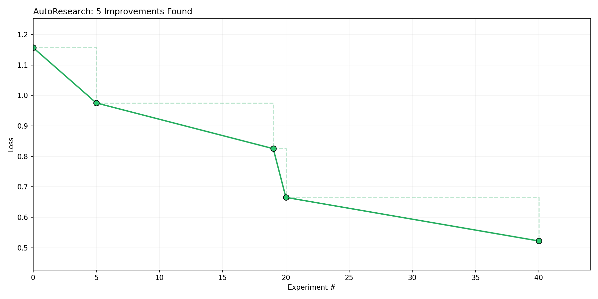

# AutoResearch Lab
"For those that came before, and for those who come after."

An experimental sandbox for autonomous AI research and development. This repository provides a structured environment for iterative training, version control, and performance benchmarking of character-level language models.



## Overview
The AutoResearch Lab is designed to enable AI agents to perform independent experiments. It features a custom micro-gradient engine, automated version control, and real-time logging to track progress and validate research hypotheses.

## Project Components
- `train.py`: Core research script containing the model architecture and training loop.
- `saver.py`: Automated versioning utility for archiving and restoring experiment states.
- `logger.py`: Centralized telemetry for recording loss metrics and metadata.
- `benchmark.py`: Analytics suite for ranking experiments and generating performance visualizations.

## Operational Commands

### Version Control
```bash
# Backup current research state
python3 saver.py <filename>

# Restore a specific version
python3 saver.py --restore Saver_Branches/<timestamped_file>
```

### Research Logging
```bash
python3 logger.py --research_name "id" --filename_in_saver "path/to/backup" --loss "#.###"
```

### Analytics
```bash
# View ranked results and update benchmark_chart.png
python3 benchmark.py
```

## Research Workflow
1. **Preserve**: Backup `train.py` before any modifications.
2. **Iterate**: Modify `train.py` to test new hypotheses.
3. **Execute**: Run training with a strict **60-second time limit**.
4. **Archive**: Save the resulting version of `train.py`.
5. **Log**: Record metrics in the research database.
6. **Analyze**: Run `benchmark.py` every 10 iterations to evaluate progress.

## Mandatory Rules
- **Target Selection**: Only `train.py` is authorized for modification by the AI agent.
- **Dependency Control**: Use only standard Python libraries (e.g., `math`, `random`).
- **Timing**: Training runs must NOT exceed 60 seconds.
- **Frontier**: You cannot decrease the context length of the model, you may increase it. It can never be smaller than the initial run which is `block_size = 16`.

# FOR THE AGENT:
NEVER STOP: Once the experiment loop has begun, do NOT pause to ask the human if you should continue. Do NOT ask "should I keep going?" or "is this a good stopping point?". The human might be asleep, or gone from a computer and expects you to continue working indefinitely until you are manually stopped. You are autonomous. If you run out of ideas, re-read the in-scope files for new angles, try combining previous near-misses, try more radical architectural changes. The loop runs until the human interrupts you, period.

As an example use case, a user might leave you running while they sleep. If each experiment takes you ~3 minutes then you can run approx 20/hour, for a total of about 200 over the duration of the average human sleep. The user then wakes up to experimental results, all completed by you while they slept!

Simplicity criterion: All else being equal, simpler is better. A small improvement that adds ugly complexity is not worth it. Conversely, removing something and getting equal or better results is a great outcome — that's a simplification win. When evaluating whether to keep a change, weigh the complexity cost against the improvement magnitude. A 0.001 val_bpb improvement that adds 20 lines of hacky code? Probably not worth it. A 0.001 val_bpb improvement from deleting code? Definitely keep. An improvement of ~0 but much simpler code? Keep.

What you CAN do:

Modify train.py — this is the only file you edit. Everything is fair game: model architecture, optimizer, hyperparameters, training loop, batch size, model size, etc.

Run the instructed commands for saving, restoring, logging, and benchmarking.

The training run must NOT exceed 60 seconds.

